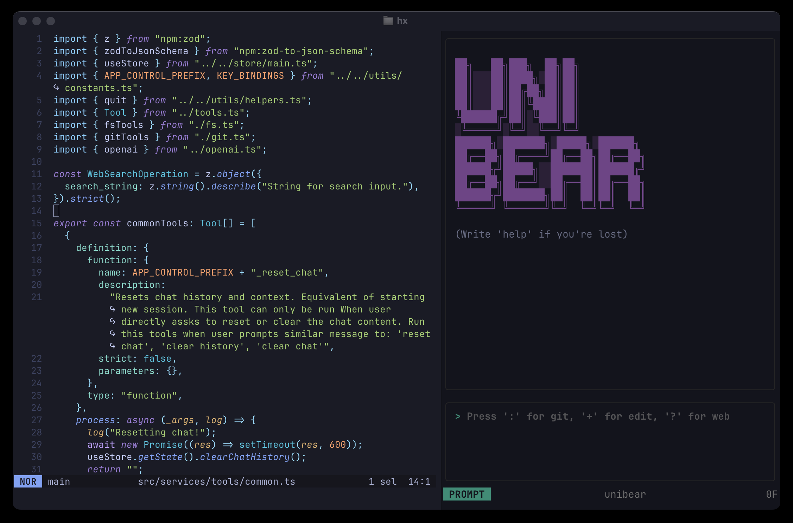
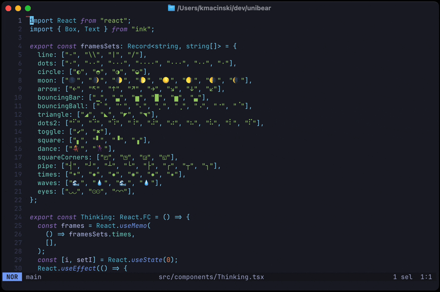

# Unibear

[](LICENSE)
[](https://github.com/kamilmac/unibear/releases)

<p align="center">
  
</p>
<p align="center">
  A lean TUI AI assistant: run your tools, stay in control, no magic tricks.
</p>




## Table of Contents

- [Installation](#installation)
- [Getting Started](#getting-started)
- [Editor Integrations](#editor-integrations)
- [Configuration](#configuration)
- [Modes](#modes)
  - [Prompt Mode](#prompt-mode)
  - [Visual Mode](#visual-mode)
- [Tools](#tools)
- [Key Bindings](#key-bindings)
- [Development](#development)
- [Contributing](#contributing)
- [Roadmap](#roadmap)
- [FAQ](#faq)

<br>

## Installation

```bash
curl -fsSL \
  https://raw.githubusercontent.com/kamilmac/unibear/main/install.sh \
  | bash
```

> Ensure `OPENAI_API_KEY`, `ANTHROPIC_API_KEY`, or `GEMINI_API_KEY` are set in
> your environment, depending on the provider you intend to use. (OpenAI,
> Anthropic, Gemini, and Ollama (for local LLMs) are supported). For Ollama, you
> might also need to set `OPENAI_API_URL` (see "Using a local LLM" section).

Launch Unibear in your git repository:

```bash
unibear
```

<br>

## Getting Started

Follow these steps to begin using Unibear:

1. Launch Unibear\
   Run the following command in your workspace root so that all files\
   in this directory are accessible:
   ```bash
   unibear
   ```

2. Configure your editor\
   Map a key to send the current buffer or file to Unibear:

   - **Neovim**
     ```vim
     nnoremap <leader>ua :silent !unibear add_file %:p<CR>
     ```

   - **Helix**
     ```toml
     [keys.normal]
     C-a = [":sh unibear add_file %{buffer_name}"]
     ```
   (Unibear can also search for files and list directories)

3. Brainstorm and iterate
   - Press `i` to enter **Prompt Mode**, type your prompt, and hit ↵ to\
     get AI suggestions. Continue iterating until you're satisfied.
   - Press `Esc` to switch to **Visual Mode**. Navigate with `j`/`k`,\
     scroll fast with `J`/`K`, jump to top (`gg`) or bottom (`G`/`ge`),\
     select (`v`), yank (`y`), paste (`p`), or delete chat items with (`d`).\
     You probably noticed that these keybindings are inspired by Helix\
     and Neovim.

4. Apply edits\
   Press your `useModifyTools` key (default `+`) to enable write tools,\
   then instruct the AI to apply changes to your files and commit them.\
   (Read-only tools are available in default mode).

<br>

## Features

- 🚀 Work in **Prompt** or **Visual** (Vim/Helix-like) modes
- 🔍 Inject arbitrary file context
- 🔧 Built-in Git, filesystem, and web-search tools
- 🤝 Plan & pair-program with your AI buddy before applying edits
- 🖥️ Responsive TUI
- 📁 Ability to use a local LLM server that supports the OpenAI chat completions
  API (eg. Ollama)

<br>

## Editor Integrations

> Only one Unibear instance at a time (it runs a local server).

### Helix

Add a buffer to Unibear’s context:

```bash
unibear add_file <path/to/file>
```

Example Helix mapping:

```toml
# ~/.config/helix/config.toml
[keys.normal]
C-a = [":sh unibear add_file %{buffer_name}"]
```

<br>

### Neovim

Bind a key to send the current buffer path to Unibear:

#### init.vim

```vim
nnoremap <leader>ua :silent !unibear add_file %:p<CR>
```

#### init.lua

```lua
vim.keymap.set("n", "<leader>ua", function()
  vim.cmd("silent !unibear add_file " .. vim.fn.expand("%:p"))
end, { noremap = true, silent = true })
```

<br>

## Configuration

Create `~/.config/unibear/config.json`:

> Note: Supported providers are `openai`, `anthropic`, `gemini`, and `ollama`.

```json
{
  "provider": "openai", // or "anthropic", "gemini", "ollama"
  "model": "o4-mini",
  "reasoning_effort": "medium", // controls depth of reasoning: low, medium, or high
  "web_search_model": "gpt-4.1-mini",
  "temperature": 0.7,
  "system": "Your custom system prompt",
  "port": 12496,
  "theme": "dark",
  "user_name": "Alice",
  "key_bindings": {
    "useModifyTools": "+"
  }
}
```

<br>

### Using a local LLM (eg. Ollama)

Unibear supports using local LLMs via the OpenAI chat completions API by
providing `OPENAI_API_URL` environment variable.

```bash
# Example using Ollama:
OPENAI_API_URL=http://localhost:11434/v1 unibear
```

## Modes

### Prompt Mode

- Press `i`
- Type your prompt and hit ↵
- Invoke tools like file operations, git commands, or web search

### Visual Mode

- Press `Esc`
- Navigate output with `j`/`k` (or `J`/`K` for big scroll)
- Select (`v`), yank (`y`), paste (`p`), delete (`d`)
- Jump to top (`gg`) or end (`G`/`ge`)

<br>

## Tools

| Tool Mode | Key | Commands                                                                                                                                                                                            |
| --------- | --- | --------------------------------------------------------------------------------------------------------------------------------------------------------------------------------------------------- |
| Normal    | –   | read_multiple_files, search_files, search_content, list_directory, git_get_diff_to_base, git_get_working_diff, git_generate_commit_message, git_review, git_create_pr_description, web_search, help |
| Modify    | `+` | edit_file, write_file, create_directory, git_commit                                                                                                                                                 |

<br>

## Key Bindings

```json
{
  "visual": {
    "quit": ["ctrl-q"],
    "clearChat": ["ctrl-d"],
    "promptMode": ["i"],
    "moveUp": ["k"],
    "moveDown": ["j"],
    "bigMoveUp": ["K"],
    "bigMoveDown": ["J"],
    "select": ["v"],
    "yank": ["y"],
    "paste": ["p"],
    "delete": ["d"],
    "goToTop": ["gg"],
    "goToEnd": ["G", "ge"]
  },
  "tools": {
    "modify": ["+"]
  }
}
```

<br>

## Development

Clone the repo and get going locally:

```bash
git clone https://github.com/kamilmac/unibear.git
cd unibear
```

Leverage the built-in Deno tasks:

```bash
# watch & run in dev mode
deno task dev

# compile a standalone binary
deno task compile

# faster compile skipping type checks
deno task compile-no-check
```

<br>

## Contributing

Contributions welcome! Please open issues or pull requests with clear
descriptions. Follow DWYL style guide and run `deno fmt` & `deno lint`.

## Roadmap

- Better Windows build support
- Enhanced LLM model options
- Support for images
- Tools as plugins architecture

## FAQ

**Q: Port already in use?**\
A: Run `lsof -i :<port>` and kill the process or change `port` in config.

**Q: Invalid API key?**\
A: Ensure `OPENAI_API_KEY`, `ANTHROPIC_API_KEY`, or `GEMINI_API_KEY` is set
correctly in your environment, corresponding to the selected `provider` in your
configuration. For Ollama, an API key is typically not required if using the
default "ollama" value.

## License

MIT
