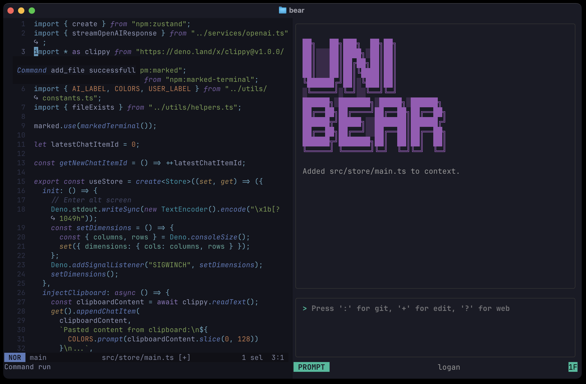

# Unibear

[](https://github.com/kamilmac/unibear/actions/workflows/ci.yml) [](LICENSE) [](https://github.com/kamilmac/unibear/releases) [](https://deno.land/x/unibear)

A developer-focused terminal AI assistant for seamless code exploration and editing.

(**not so magical**) terminal-based AI assistant powered by Deno, Ink, and OpenAI.

LLM support expanding soon.



## Table of Contents

- [Features](#features)
- [Installation](#installation)
- [Quick Start](#quick-start)
- [Modes](#modes)
  - [Prompt Mode](#prompt-mode)
  - [Visual Mode](#visual-mode)
- [Editor Integrations](#editor-integrations)
- [Configuration](#configuration)
- [Tools](#tools)
- [Key Bindings](#key-bindings)
- [Contributing](#contributing)
- [Roadmap](#roadmap)
- [FAQ](#faq)

---

## Features

- 🚀 Work in **Prompt** or **Visual** (Vim/Helix-like) modes
- 🔍 Inject arbitrary file context
- 🔧 Built-in Git, filesystem and web-search tools
- 🤝 Plan & pair-program with your AI buddy before applying edits
- 🖥️ Responsive TUI

---

## Installation

```bash
curl -fsSL \
  https://raw.githubusercontent.com/kamilmac/unibear/main/install.sh \
  | sh
```

> Ensure `OPENAI_API_KEY` is set in your environment.

---

## Quick Start

1. Launch Unibear:
   ```bash
   unibear
   ```
2. Switch modes with `i` (Prompt) and `Esc` (Visual).
3. Enable tools via their special keys (see Key Bindings).

---

## Modes

### Prompt Mode

- Press `i`
- Type your prompt and hit ↵
- Invoke tools like `edit`, `git`, or `web_search`

### Visual Mode

- Press `Esc`
- Navigate output with `j`/`k` (or `J`/`K` for big scroll)
- Select (`v`), yank (`y`), paste (`p`), delete (`d`)
- Jump to top (`gg`) or end (`G`/`ge`)

---

## Editor Integrations

> Only one Unibear instance at a time (it runs a local server).

### Helix / Vim

Add a buffer to Unibear’s context:

```bash
unibear add_file <path/to/file>
```

Example Helix mapping:

```toml
# ~/.config/helix/config.toml
[keys.normal]
C-a = [":sh unibear add_file %{buffer_name}"]
```

---

## Configuration

Create `~/.config/unibear/config.json`:

```json
{
  "model": "o4-mini",
  "system": "Your custom system prompt",
  "port": 12496,
  "theme": "dark",
  "user_name": "Alice",
  "key_bindings": {
    "useGitTools": ":",
    "useEditTools": "+",
    "useWebTools": "?"
  }
}
```

---

## Tools

| Tool Group | Key | Commands                                                                          |
| ---------- | --- | --------------------------------------------------------------------------------- |
| Default    | –   | read_multiple_files, search_files, app_control_reset_chat, app_control_quit, help |
| Git        | `:` | git_auto_commit, git_review, git_create_pr_description                            |
| Edit       | `+` | edit_file                                                                         |
| Web        | `?` | web_search                                                                        |

---

## Key Bindings

```json
{
  "promptMode": ["i"],
  "visual": {
    "moveUp": ["k"],
    "moveDown": ["j"],
    "bigMoveUp": ["K"],
    "bigMoveDown": ["J"],
    "select": ["v"],
    "yank": ["y"],
    "paste": ["p"],
    "delete": ["d"],
    "goToTop": ["gg"],
    "goToEnd": ["G", "ge"]
  },
  "tools": {
    "git": [":"],
    "edit": ["+"],
    "web": ["?"]
  }
}
```

---

## Contributing

Contributions welcome! Please open issues or pull requests with clear descriptions. Follow DWYL style guide and run `deno fmt` & `deno lint`.

## Roadmap

- Better Windows build support
- Enhanced LLM model options
- Support for images
- Tools as plugins architecture

## FAQ

**Q: Port already in use?**  
A: Run `lsof -i :<port>` and kill the process or change `port` in config.

**Q: Invalid API key?**  
A: Ensure `$OPENAI_API_KEY` is set correctly.

## License

MIT
